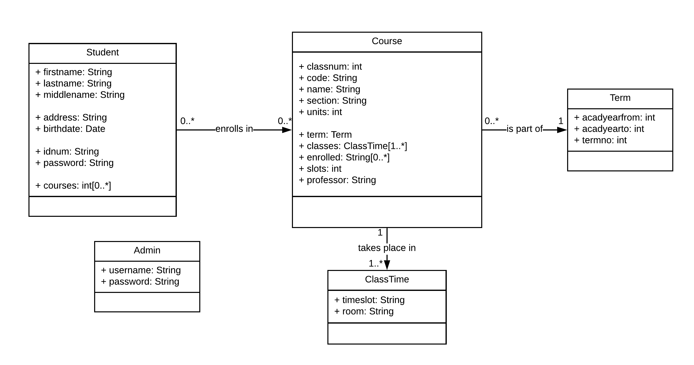

# Database Schema

[Edit the schema diagram here.](https://www.lucidchart.com/invitations/accept/a91dc9a8-4f31-4c0d-9ab3-94d85534b896)

---
# Relation to Features

| Feature | Student | Course | ClassTime | Term | Admin |
| ------- | ------- | ------ | --------- | ---- | ----- |
| Search and view course offerings | | Read | Read (as part of course model) | Read (as part of course model) | |
| Enlist in a course | Read, update (read courses enlisted and check for conflicts) | Read, update (update students enrolled) | Read (as part of course model) | Read (as part of course model) | |
| Log in | Read (check for credentials) | | | | Read (check for credentials) |
| Drop a course | Read, update (update enrollment list) | Read, update (update students enrolled) | Read (as part of course model) | Read (as part of course model) | |
| View schedule | Read (get current courses enlisted) | Read (as part of student model) | Read (as part of course model) | Read (as part of course model) | |
| Register as user | Create | | | | |
| Add a course | | Read, create (check for conflicting names) | Read, create (check for conflicting timeslots) | Read, create (check for conflicting terms) | |
| Remove a course | Update (Drop students on delete) | Delete | Delete (as part of course model) | Delete (as part of course model) | |
| Edit a course | Read, update (Drop students on edit) | Read, update (Update data and drop currently enrolled) | Read, update (as part of course model) | Read, update (as part of course model) | |
